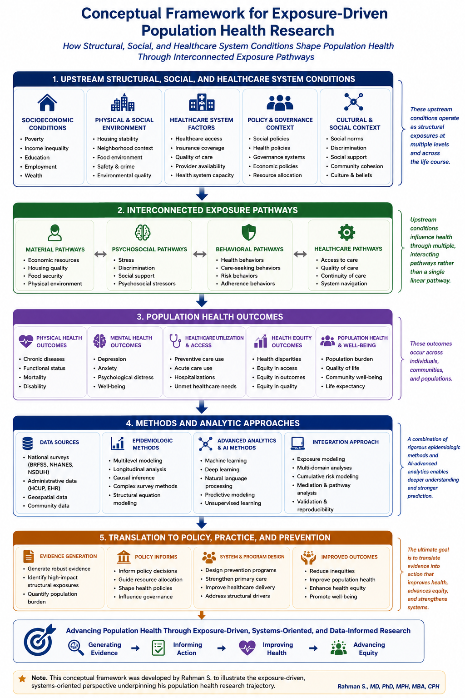

# Conceptual Framework Guiding My Population Health Research Program

**Shams Rahman, MD, PhD, MPH, MBA, CPH**  
Assistant Professor of Public Health

*A systems-oriented, exposure-driven framework illustrating how upstream conditions shape population health through interconnected pathways, advanced epidemiologic methods, and evidence translation.*

## Overview

This conceptual framework summarizes the exposure-driven, systems-oriented perspective that guides my population health research program. It illustrates how upstream structural, social, environmental, and healthcare system conditions shape health through interconnected exposure pathways across the life course, ultimately influencing health outcomes, healthcare systems, and health equity.

Together, these domains support a coherent research program focused on generating evidence that informs prevention, strengthens healthcare systems, improves healthcare delivery, and advances health equity.

---

## Conceptual Framework

---

## Research Areas

- Social Epidemiology
- Health Equity and Health Disparities
- Healthcare Systems Research
- Population Health Surveillance
- Chronic Disease Epidemiology
- Advanced Epidemiologic Methods
- Artificial Intelligence and Data Science
- Translation of Evidence into Policy and Practice

---

## Suggested Citation

Rahman S. *Conceptual Framework Guiding My Exposure-Driven Population Health Research Program.* 2026.

---

## Contact

**Shams Rahman, MD, PhD, MPH, MBA, CPH**  
Assistant Professor of Public Health  

GitHub Repository:  
https://github.com/Shams1616/research-framework
